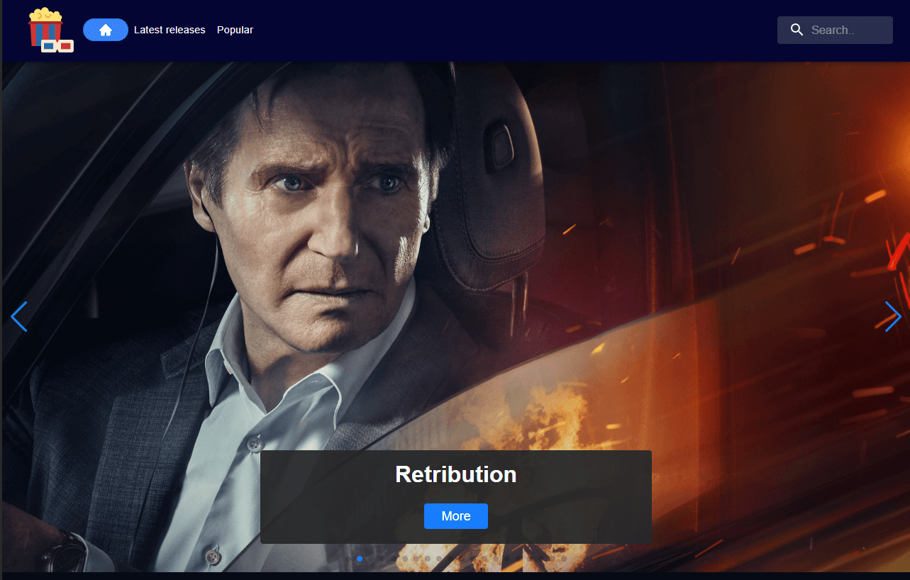
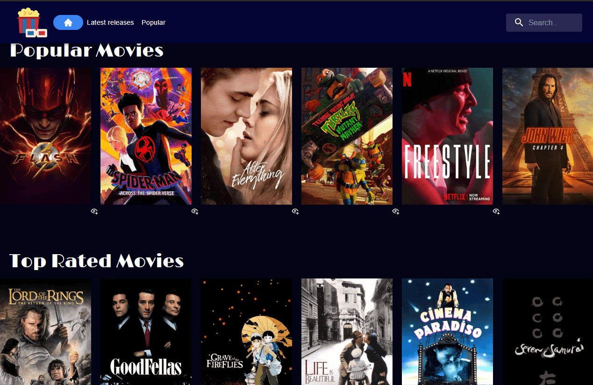
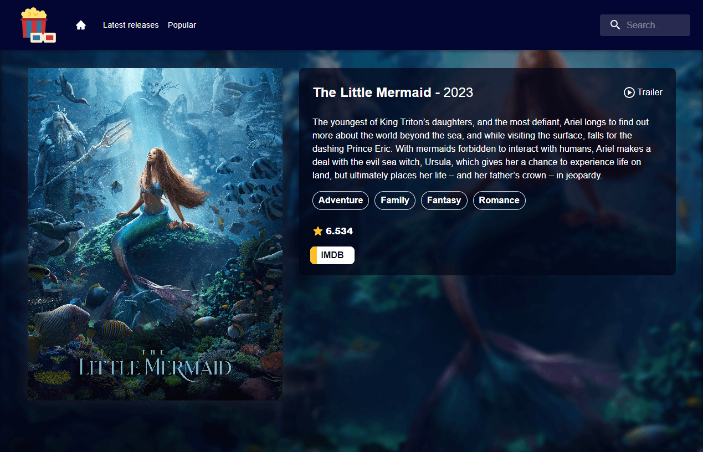
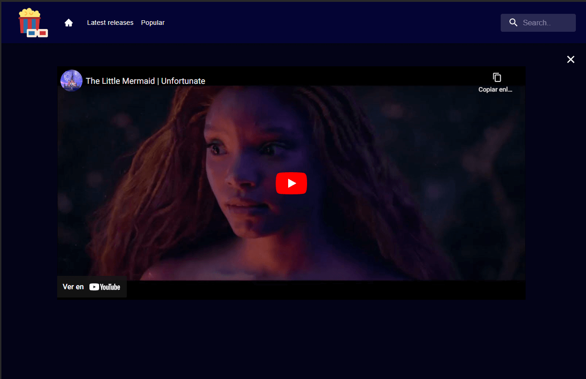
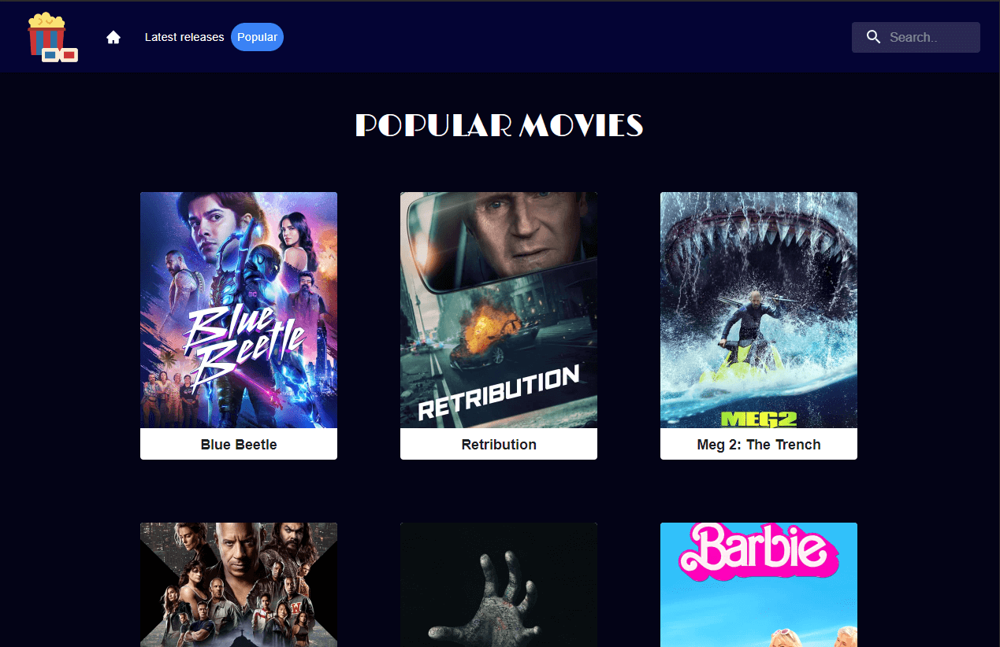
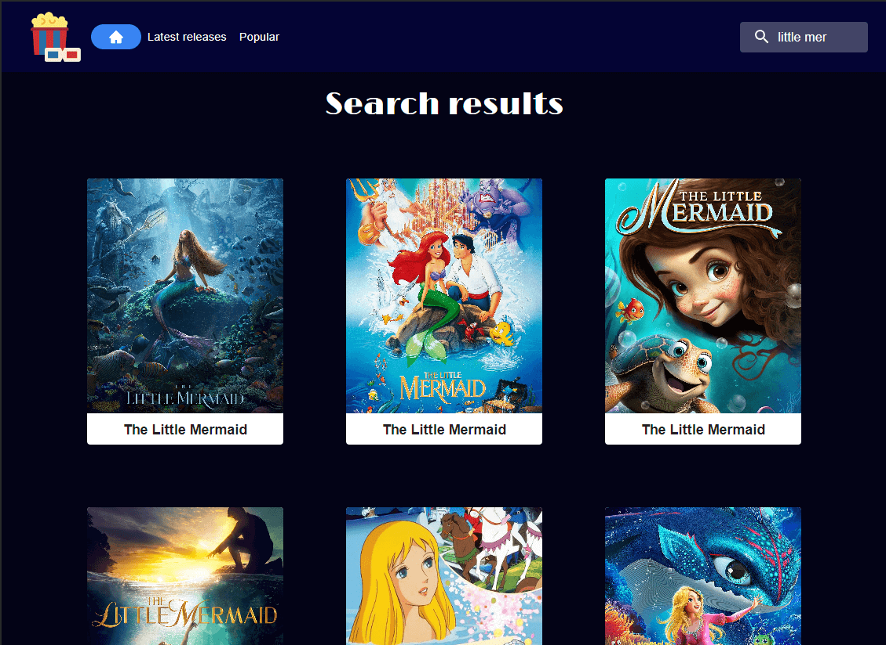
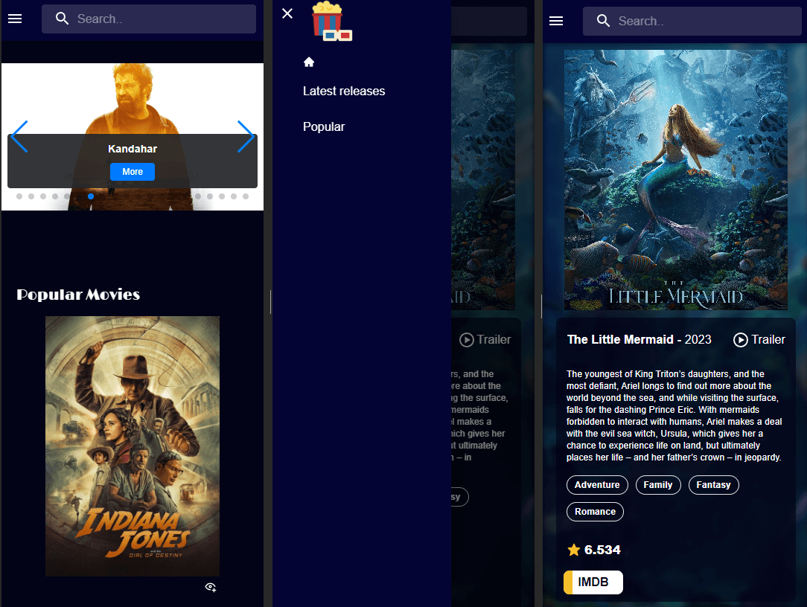

# Proyecto Peliculas App

Hola somos Rocio Magalí Chaparro y Verónica Guiñanen estudianes de Ada ITW y en esta oportunidad les mostramos el último proyecto del último módulo de React Js llamado Peliculas App.
***

## Índice

- [Descripción del proyecto](#Descripción-del-proyecto)
- [Herramientas utilizadas](#Herramientas-utilizadas)
- [Ver el proyecto](#ver-el-proyecto)
- [Preview del proyecto](#preview-del-proyecto)
- [Desarrolladores](#desarrolladores)
- [Contacto](#contacto)

***

### Descripción del proyecto

El proyecto "Peliculas App" es una aplicación web desarrollada utilizando tecnologías como React JS con Vite, React Router DOM para la navegación entre vistas, y una combinación de frameworks de estilo como Swiper, Tailwind y Material-UI. Esta aplicación aprovecha la API de TMDB a través de Axios para acceder a información sobre películas.

En "Peliculas App," los usuarios pueden explorar películas de diversas maneras. Pueden buscar películas específicas, ver las películas más populares, las mejor puntuadas, los últimos lanzamientos y las películas que actualmente están en cartelera las cuales se muestran siempre en el banner principal. Cuando los usuarios seleccionan una película, tienen acceso a información detallada, que incluye una breve descripción, los géneros a los que pertenece, el año de lanzamiento, el tráiler y un enlace a la página de IMDb para obtener más información.

En resumen, ofrece a los usuarios una experiencia completa para explorar y obtener detalles sobre todas las películas de su interés, todo ello enmarcado en una interfaz de usuario atractiva y amigable gracias a las tecnologías y frameworks utilizados en su desarrollo.
***

### Herramientas utilizadas
- HTML5
- CSS3
- Git
- Github
- Vite
- Axios
- ReactJs
- React Icons
- Tailwind
- Material-UI
- Styled components
- Swiper
***

### Ver el proyecto
Para poder visualizar el proyecto simplemente colocá el siguiente enlace en tu navegador preferido:

https://peliculas-app-tan.vercel.app/

### Preview del proyecto

Desktop:

Home

Detalles

Populares

Resultados de búsqueda

Mobile:

Vistas

### Desarrolladores

- Rocío Magalí Chaparro
- Verónica Guiñan

***
### Contacto
Si te gustó nuestro proyecto y te interesa nuestro trabajo, podes contactarnos a cualquiera de nuestras redes sociales.

Rocío Magalí Chaparro
- Github: <a href="https://github.com/Rocio-Ch" name="github">Rocío-Ch</a> 
- Mail: <a href="mailto:rociomagali77@gmail.com" name="mail">rociomagali77@gmail.com</a>
- Linkedin: <a href="https://www.linkedin.com/in/roc%C3%ADo-magal%C3%AD-chaparro-a3530a239/" name="linkedIn">Rocío Magalí Chaparro</a>

Verónica Guiñan
- Github: <a href="https://github.com/veronicadelmar" name="github">veronicadelmar</a> 
- Mail: <a href="mailto:unachamacaqueprograma@gmail.com" name="mail">unachamacaqueprograma@gmail.com</a>
- Linkedin: <a href="https://www.linkedin.com/in/veronicagui%C3%B1an/" name="linkedIn">Verónica Guiñan</a>
